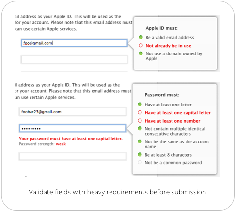
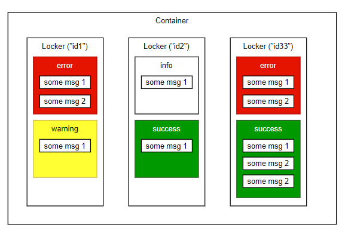

# MessageContainer
It is a Message Container for PHP, similar in functionality **MessageBag** for Laravel

[](https://packagist.org/packages/eftec/MessageContainer)
[](https://packagist.org/packages/eftec/MessageContainer)
[]()
[]()
[]()
[]()
[]()
[]()


## What is the objective?

This library stores messages in different lockers and each locker could contain different messages with different levels (error, warning, info and success). The goal of this library:

* It stores messages depending of an "id" and storing the severity of it.
* The library mustn't trigger an error if the "id" does not exists, or if it is empty or not.  So it avoid the use of **isset()** in our code.
  * It returns an empty value if the message does not exist
  * It returns an empty array if the group of message does not exist
  * It returns an empty locker if the locker does not exist.
* It is possible to returns the first error or warning at the same time. In this case, if the locker stores an error and a warning, then it returns the error (it has priority).
* It is able to returns:
  * all messages stored in some locker or container.
  * the first message (with or without some level)
  * the number of messages (for some level)
  * if the container of locker has error or warning.

It is an example from where we could use it, the validation of a form (this library does not validate or show values it only stores the information)



In this example, we have :

* one container (the form)
* multiples textboxes (each one is a locker)
*  and each textbox (our lockers) could contain one of more messages with different levels (in this case, success or error).


## How to use it

```php
use eftec\MessageContainer;
$container=new MessageContainer(); // we create the full containers
$container->addItem('locker1','It is a message','warning');  // we store a message inside "id1"
$container->addItem('locker1','It is a message','error');  // we store another message inside "id1"

// And later, you can process it

$lastErrorsOrWarnings=$container->get('locker1')->allErrorOrWarning();
// it will not crash even if the locker2 does not exists.
$lastErrorsOrWarnings2=$container->get('locker2')->allErrorOrWarning();

```

## Definitions



We have 3 levels of spaces.

* **Container**. Usually it is unique and it is defined by our instance of **MessageContainer**.  The container could contains from zero to multiples lockers. Each locker is identified by an unique "id".
* **Locker**. Every time we add an item, we could create or update a new container.   Every locker could contain from zero to many error, warning, info or success and each one could contain from zero to many messages.
* Our **messages** or **items** are categorized in 4 levels, error, warning, info and success.  Each level could contain one or many messages (or none)

Example:

```php
$container=new MessageContainer();
$container->addItem('id1','some msg 1','error');
$container->addItem('id1','some msg 2','error');
$container->addItem('id1','some msg 1','warning');

$container->addItem('id2','some msg 1','info');
$container->addItem('id2','some msg 1','success');

$container->addItem('id33','some msg 1','error');
$container->addItem('id33','some msg 2','error');
$container->addItem('id33','some msg 1','success');
$container->addItem('id33','some msg 2','success');
$container->addItem('id33','some msg 2','success');

// obtaining information per locker
$msg=$container->getLocker('id1')->firstErrorOrWarning(); // returns if the locker id1 has an error or warning
$msg2=$container->getLocker('id2')->allInfo(); // returns all info store in locker id2 ["some msg1","some msg2"]
$msg3=$container->getLocker('id3')->allInfo(); // (note this locker is not defined so it returns an empty array.
$msg4=$container->getLocker('id33')->hasError(); // returns true if there is an error.
$msg5=$container->getLocker('id33')->countError(); // returns the number of errors (or zero if none).

// obtaining information globally (all lockers)
$msg7=$container->hasError(); // returns true if there is an error in any locker.
$msg8=$container->allErrorArray(true); // returns all errors and warnings presents in any locker.
```

## Table of Content

- [MessageContainer](#messagecontainer)
  - [What is the objective?](#what-is-the-objective)
  - [How to use it](#how-to-use-it)
  - [Definitions](#definitions)
  - [MessageContainer](#messagecontainer)
    - [Field items (MessageLocker[])](#field-items-messagelocker)
    - [Field errorCount (int)](#field-errorcount-int)
    - [Field warningCount (int)](#field-warningcount-int)
    - [Field errorOrWarningCount (int)](#field-errororwarningcount-int)
    - [Field infoCount (int)](#field-infocount-int)
    - [Field successCount (int)](#field-successcount-int)
    - [Field cssClasses (string[])](#field-cssclasses-string)
    - [Method __construct()](#method-__construct)
    - [Method resetAll()](#method-resetall)
    - [Method addItem()](#method-additem)
    - [Method allIds()](#method-allids)
    - [Method getMessage()](#method-getmessage)
    - [Method get()](#method-get)
    - [Method cssClass()](#method-cssclass)
    - [Method firstErrorOrWarning()](#method-firsterrororwarning)
    - [Method firstErrorText()](#method-firsterrortext)
    - [Method firstWarningText()](#method-firstwarningtext)
    - [Method firstInfoText()](#method-firstinfotext)
    - [Method firstSuccessText()](#method-firstsuccesstext)
    - [Method allInfoArray()](#method-allinfoarray)
    - [Method allWarningArray()](#method-allwarningarray)
    - [Method AllSuccessArray()](#method-allsuccessarray)
    - [Method allArray()](#method-allarray)
    - [Method allErrorOrWarningArray()](#method-allerrororwarningarray)
    - [Method allErrorArray()](#method-allerrorarray)
    - [Method hasError()](#method-haserror)
  - [MessageLocker](#messagelocker)
    - [Method __construct()](#method-__construct)
    - [Method addError()](#method-adderror)
    - [Method addWarning()](#method-addwarning)
    - [Method addInfo()](#method-addinfo)
    - [Method addSuccess()](#method-addsuccess)
    - [Method countError()](#method-counterror)
    - [Method countErrorOrWarning()](#method-counterrororwarning)
    - [Method countWarning()](#method-countwarning)
    - [Method countInfo()](#method-countinfo)
    - [Method countSuccess()](#method-countsuccess)
    - [Method firstError()](#method-firsterror)
    - [Method firstErrorOrWarning()](#method-firsterrororwarning)
    - [Method firstWarning()](#method-firstwarning)
    - [Method firstInfo()](#method-firstinfo)
    - [Method firstSuccess()](#method-firstsuccess)
    - [Method first()](#method-first)
    - [Method allError()](#method-allerror)
    - [Method allErrorOrWarning()](#method-allerrororwarning)
    - [Method allWarning()](#method-allwarning)
    - [Method allInfo()](#method-allinfo)
    - [Method allSuccess()](#method-allsuccess)
    - [Method hasError()](#method-haserror)
  - [changelog](#changelog)

------


## MessageContainer

Class MessageList
### Field items (MessageLocker[])
Array of containers
### Field errorCount (int)
Number of errors stored globally
### Field warningCount (int)
Number of warnings stored globally
### Field errorOrWarningCount (int)
Number of errors or warning stored globally
### Field infoCount (int)
Number of information stored globally
### Field successCount (int)
Number of success stored globally
### Field cssClasses (string[])
Used to convert a type of message to a css class

### Method __construct()
MessageList constructor.

### Method resetAll()
It resets all the container and flush all the results.

### Method addItem()
You could add a message (including errors,warning..) and store it in a $idLocker
#### Parameters:
* **$idLocker** Identified of the locker (where the message will be stored) (string)
* **$message** message to show. Example: 'the value is incorrect' (string)
* **$level** =['error','warning','info','success'][$i] (string)

### Method allIds()
It obtains all the ids for all the lockers.

### Method getMessage()
It returns a MessageLocker containing an locker.<br>
<b>If the locker doesn't exist then it returns an empty object (not null)</b>
#### Parameters:
* **$idLocker** Id of the locker (string)

### Method get()
Alias of $this->getMessage()
#### Parameters:
* **$idLocker** Id of the locker (string)

### Method cssClass()
It returns a css class associated with the type of errors inside a locker<br>
If the locker contains more than one message, then it uses the most severe one (error,warning,etc.)
#### Parameters:
* **$idLocker** Id of the locker (string)

### Method firstErrorOrWarning()
It returns the first message of error (if any)<br>
If not, then it returns the first message of warning (if any)

### Method firstErrorText()
It returns the first message of error (if any)
#### Parameters:
* **$includeWarning** if true then it also includes warning but any error has priority. (bool)

### Method firstWarningText()
It returns the first message of warning (if any)

### Method firstInfoText()
It returns the first message of information (if any)

### Method firstSuccessText()
It returns the first message of success (if any)

### Method allInfoArray()
It returns an array with all messages of info of all lockers.

### Method allWarningArray()
It returns an array with all messages of warning of all lockers.

### Method AllSuccessArray()
It returns an array with all messages of success of all lockers.

### Method allArray()
It returns an array with all messages of any type of all lockers

### Method allErrorOrWarningArray()
It returns an array with all messages of errors and warnings of all lockers.

### Method allErrorArray()
It returns an array with all messages of error of all lockers.
#### Parameters:
* **$includeWarning** if true then it also include warnings. (bool)

### Method hasError()
It returns true if there is an error (or error and warning).
#### Parameters:
* **$includeWarning** If true then it also returns if there is a warning (bool)

------

## MessageLocker
Class MessageLocker

### Method __construct()
MessageLocker constructor.

### Method addError()
It adds an error to the locker.
#### Parameters:
* **$msg** param mixed $msg (mixed)

### Method addWarning()
It adds a warning to the locker.
#### Parameters:
* **$msg** param mixed $msg (mixed)

### Method addInfo()
It adds an information to the locker.
#### Parameters:
* **$msg** param mixed $msg (mixed)

### Method addSuccess()
It adds a success to the locker.
#### Parameters:
* **$msg** param mixed $msg (mixed)

### Method countError()
It returns the number of errors contained in the locker

### Method countErrorOrWarning()
It returns the number of errors or warnings contained in the locker

### Method countWarning()
It returns the number of warnings contained in the locker

### Method countInfo()
It returns the number of infos contained in the locker

### Method countSuccess()
It returns the number of successes contained in the locker

### Method firstError()
It returns the first message of error, if any. Otherwise it returns the default value
#### Parameters:
* **$default** param string $default (string)

### Method firstErrorOrWarning()
It returns the first message of error or warning (in this order), if any. Otherwise it returns the default value
#### Parameters:
* **$default** param string $default (string)

### Method firstWarning()
It returns the first message of warning, if any. Otherwise it returns the default value
#### Parameters:
* **$default** param string $default (string)

### Method firstInfo()
It returns the first message of info, if any. Otherwise it returns the default value
#### Parameters:
* **$default** param string $default (string)

### Method firstSuccess()
It returns the first message of success, if any. Otherwise it returns the default value
#### Parameters:
* **$default** param string $default (string)

### Method first()
It returns the first message of any kind.<br>
If error then it returns the first message of error<br>
If not, if warning then it returns the first message of warning<br>
If not, then it show the first info message (if any)<br>
If not, then it shows the first success message (if any)<br>
If not, then it shows the default message.
#### Parameters:
* **$defaultMsg** param string $defaultMsg (string)

### Method allError()
Returns all messages of errors, or an empty array if none.

### Method allErrorOrWarning()
Returns all messages of errors or warnings, or an empty array if none

### Method allWarning()
Returns all messages of warning, or an empty array if none.

### Method allInfo()
Returns all messages of info, or an empty array if none.

### Method allSuccess()
Returns all messages of success, or an empty array if none.

### Method hasError()
It returns true if there is an error (or error and warning).
#### Parameters:
* **$includeWarning** If true then it also returns if there is a warning (bool)

------


## changelog

* 1.1 2021-03-17 some cleanups
* 1.0 2021-03-17 first version 


